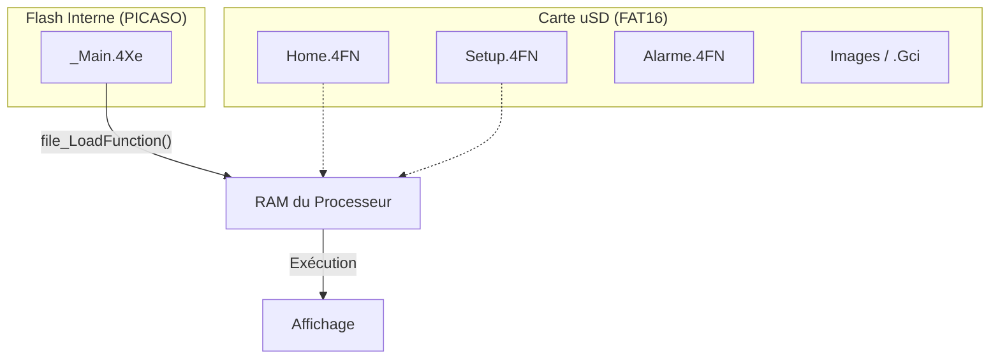
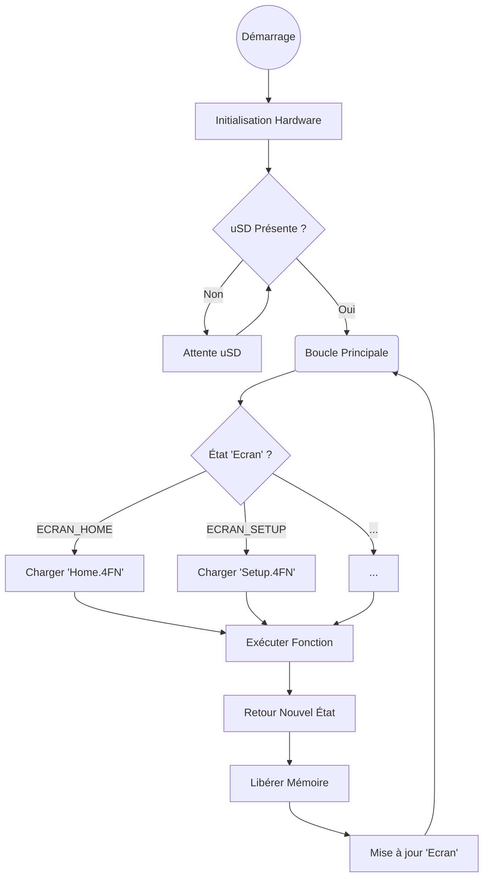

# Logique du Firmware SC945D

## Vue d'Ensemble
Le firmware du SC945D est développé en **4DGL** (4D Graphics Language) pour le processeur **PICASO-GFX2** de 4D Systems. Il adopte une architecture modulaire unique pour contourner les limitations de mémoire flash interne en utilisant la carte uSD comme stockage de programme étendu.

## Architecture Modulaire

Le système est divisé en deux parties :
1.  **Le Noyau (`_Main.4dg`)** : Un programme résident en mémoire Flash qui initialise le matériel et agit comme un ordonnanceur (scheduler).
2.  **Les Applications (`*.4FN`)** : Des modules fonctionnels indépendants stockés sur la carte uSD et chargés dynamiquement en RAM.

### Avantages
*   **Modularité** : Chaque écran ou fonctionnalité est un fichier séparé.
*   **Extensibilité** : La taille du programme n'est limitée que par la capacité de la carte SD, pas par la flash du processeur.
*   **Mise à jour** : Il est possible de mettre à jour une seule fonction en remplaçant son fichier `.4FN` sur la carte SD.

## Algorithme Principal (`_Main.4dg`)

Le fichier `SC945D/Prog/Main 1.0/_Main.4dg` est le point d'entrée. Son cycle de vie est le suivant :

### 1. Initialisation
Au démarrage, le `main()` effectue les configurations matérielles :
*   **I/O** : Configuration du switch d'ouverture (Pin 3).
*   **Audio** : Volume au maximum (`snd_Volume(127)`).
*   **Tactile** : Activation de la dalle résistive (`touch_Set(0)`).
*   **Série** : Configuration du port COM0 à 9600 bauds pour la communication avec le reste du système.
*   **Stockage** : Montage du système de fichiers FAT16 de la carte uSD (`file_Mount()`). Si la carte est absente, le système attend.

### 2. Boucle Infinie (Scheduler)
Le programme entre dans une boucle `forever` qui surveille la variable globale `Ecran`.
Pour chaque état possible de `Ecran`, le scheduler :
1.  Charge la fonction correspondante depuis la SD : `f_Ecran_ptr := file_LoadFunction("NomFichier.4FN");`
2.  Exécute la fonction en lui passant les buffers de communication et paramètres : `Ecran := f_Ecran_ptr(...);`
3.  Libère la mémoire une fois la fonction terminée : `mem_Free(f_Ecran_ptr);`

La fonction appelée gère l'interface utilisateur pour cet écran spécifique et retourne la valeur du prochain écran à afficher, ce qui pilote la machine à état.

## Compilation et Déploiement

### Environnement
*   **IDE** : 4D Workshop 4 IDE.
*   **Langage** : 4DGL (proche du C).
*   **Plateforme** : uLCD-28PT (PICASO).

### Processus de Build
La compilation génère plusieurs types de fichiers :
*   **`.4XE`** : Exécutable principal (pour la Flash).
*   **`.4FN`** : Fonctions compilées (pour la uSD).
*   **`.Gci` / `.Dat`** : Assets graphiques (Images, Icônes).

### Mise en Production
Pour déployer le firmware sur un écran :
1.  **Flasher** le `_Main.4Xe` via l'IDE et le câble de programmation 4D Systems.
2.  **Copier** tous les fichiers `.4FN`, `.Gci`, et `.Dat` sur la racine de la carte uSD.
3.  Le script `SC945D/Prog/uSD IHM 2.0/_Copy_uSD_Prod_7 (D).bat` est fourni pour automatiser la copie des fichiers nécessaires vers le lecteur `D:`.
