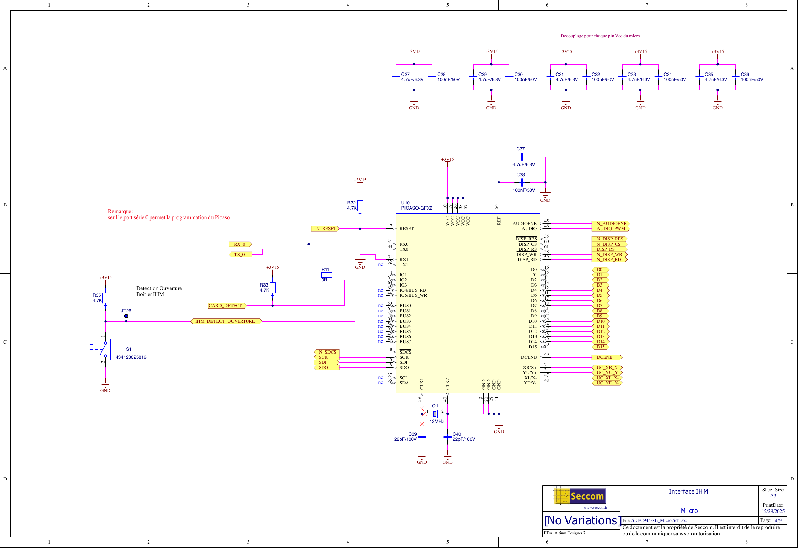
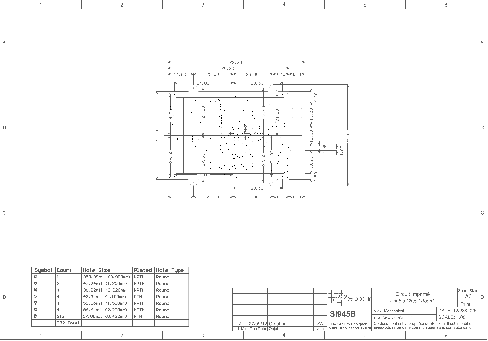

# SC945D - Écran Tactile Domotique

Bienvenue dans la documentation technique du module **SC945D**. Ce projet s'inscrit dans l'initiative **Open Source Hardware** d'Essensys.

Le SC945D est une interface utilisateur tactile compacte destinée au pilotage de la domotique.

## Aperçu - Schéma Électronique

  
  
  
  
  
  
  
  
  

[Voir le schéma complet (PDF)](assets/SC945D_Schematic.pdf){ .md-button .md-button--primary }

## Aperçu - Assemblage

  
  
  
  
  

## Documentation

Explorez les détails techniques du module :

*   [🏛️ Architecture](architecture.md) - Vue d'ensemble du système.
*   [🔌 Hardware](hardware.md) - Détails des composants et PCB.
*   [💾 Téléchargements](downloads.md) - Fichiers sources et fabrication.
*   [💻 Firmware](firmware.md) - Logiciel embarqué et PICASO-GFX2.
